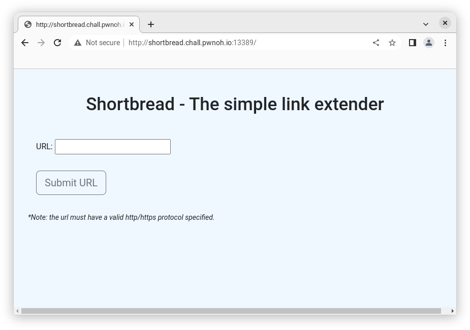
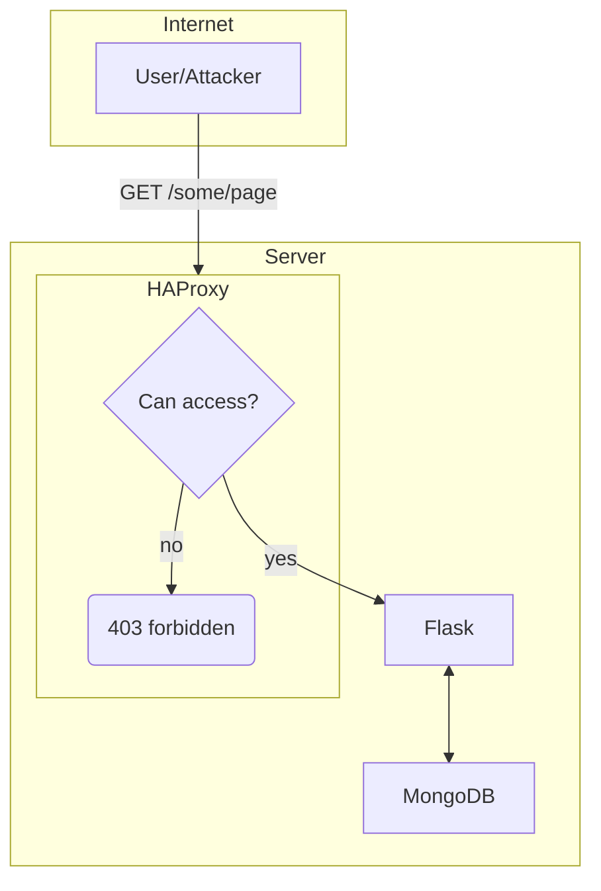
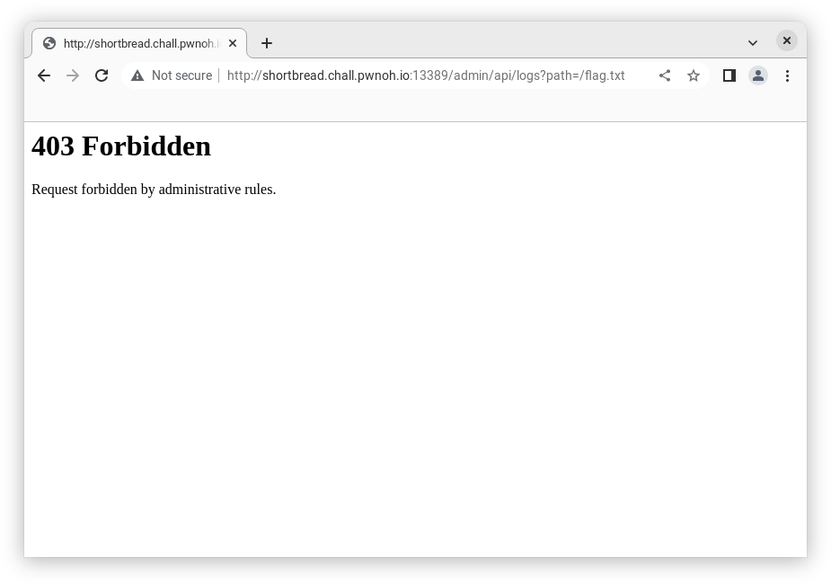
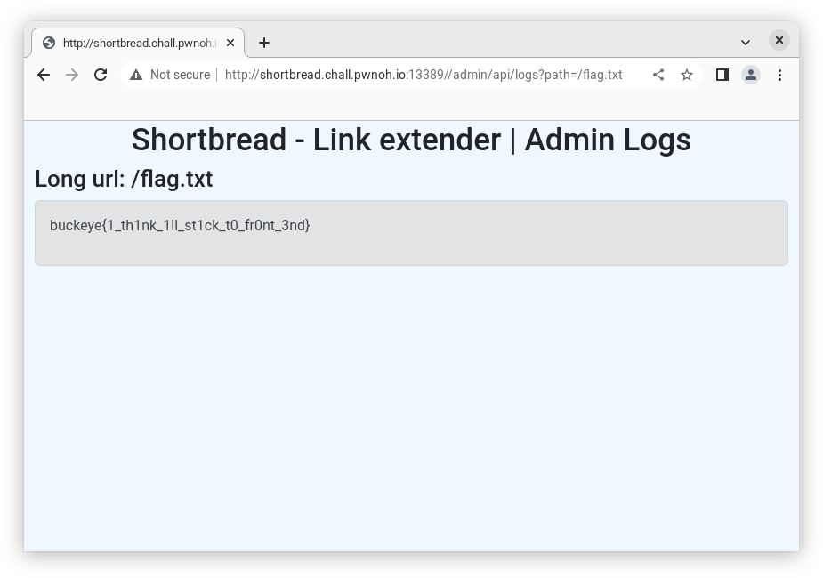

# shortbread (v0rtex)
> I'm so anti-link shortener that I've decided to create the first-ever link-extender. Put in any valid link and get returned a redirect with a URL that is 2 times as long as the original link.



## Exploration
We can diagram the web challenge like the following



The Flask webserver in `src/app.py` defines many routes. Many interact with MongoDB but it will turn out to not matter. Here are some examples routes.
```python
@app.route("/admin/api/delete/<longpath>", methods=['DELETE'])
def deleteURL(longpath):
    ...

@app.route("/", methods=['GET'])
def index():
    return render_template("index.html")

@app.route('/url/<path>', methods=['GET'])
def urlRedirect(path : str):
    ...
```

Our goal is of course to read the flag in `flag.txt`, so where does the server read the flag? We need to notice a few key functions
```python
def readLog(path : str):
    # open resource only allows accces to files within 
    # scope of current execution
    with app.open_resource(path, "r") as f:
        return f.readlines()

@app.route("/admin/api/logs", methods=['GET'])
def getLog():
    longpath = request.args.get("path")

    if longpath is None:
        return Response(json.dumps({'status':'failure'}), status=400, mimetype="application/json")

    try: 
        text = readLog(os.path.join(loggingDir, longpath))
    except FileNotFoundError:
        return Response(json.dumps({'status':'failure'}), status=404, mimetype="application/json")

    return render_template("admin.html", messages = text, url = longpath)

```
Given these two functions, if we go to `/admin/api/logs?path=/flag.txt`, it should read the flag.



The Flask webserver blindly relies on the proxy for authentication to ensure that nobody can access the `/admin` routes without permission. The rules for HAProxy are defined in `proxy/haproxy.cfg` like so:
```
acl restricted_page path,url_dec -m beg -i /admin
http-request deny if restricted_page
http-request allow if { path_beg -i /admin src} { src 127.25.0.0/20 }
```

Basically, if the path begins with (case insensitive) `/admin` it will reject it immediately unless it comes from the ip address `127.25.0.0`, which we cannot spoof.

## Exploit

What if we can come up with a path which does not being with `/admin`, but still can take us to `/admin/api/logs?path=/flag.txt`? We can look for a discrepancy between HAProxy's `path_beg -i` and the `@app.route()` in Flask to see if we can coerce HAProxy to let us through, and have Flask interpret it as a still a valid url and call the right function.

The answer is to go to `//admin/api/logs?path=/flag.txt`. Notice the extra `/` at the beginning. HAProxy does a simple check, does the path `//admin/api/logs?path=/flag.txt` begin wih `/admin`? No, it does not. So forward the request to Flask. Then Flask parses `//admin/api/logs?path=/flag.txt` as `/admin/api/logs?path=/flag.txt` and calls `getLog()` which in turn calls `readLog("/flag.txt")` and gives us the flag.


